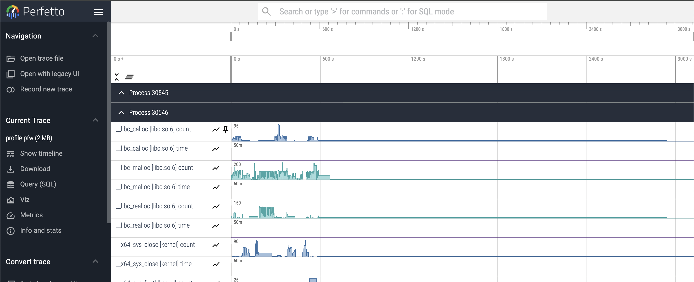

# DataCrumbs
A multi-level dataflow profiler to capture I/O calls from workflows.


## Dependency installation

### Requirements

- Newer Kernel > 5.6 [see kernel doc](https://github.com/iovisor/bcc/blob/master/docs/kernel-versions.md)
- BCC > v0.30.0
- cmake
- python 3.10
  - hydra-core>=1.2.0

**Test Requirements**

- OpenMPI

### Chameleon

We have a Image that can be used to do development on Chameleon called HARI-UBUNTU-22.04.04-BCC.


## Compiling the code

### Clone the repo

```bash
git clone https://github.com/hariharan-devarajan/datacrumbs.git

cd datacrumbs
mkdir build
cmake ..
make -j
```

## Running the code

The profiler tool need to run as root

```bash
sudo su
export PYTHONPATH=<PATH to datacrumbs>
cd <PATH to datacrumbs Root>
python3 dfprofiler/main.py
```
Once the profiler is loaded, it will wait for applictaions to connect.

### Environment variable to consider

Check ulimit -n for open file handlers

```bash
ulimit -n 1048576
```

Increase probe limit within BCC
```bash
export BCC_PROBE_LIMIT=1048576
```

## Running the test

Once the profiler has started u can run the application code.

```bash
cd <PATH to datacrumbs Root>
cd tests/scripts
./run.sh
```

## Checking the profiler output.

The profiler output is created in the directory where the profiler runs.

```bash
cc@ebpf:~/datacrumbs$ head -n 5 profile.pfw 
[
{"pid": 30545, "tid": 30545, "name": "__libc_malloc [libc.so.6]", "cat": "[libc.so.6]", "ph": "C", "ts": 0.0, "args": {"count": 21, "time": 0.000198116}}
{"pid": 30545, "tid": 30545, "name": "cfree [libc.so.6]", "cat": "[libc.so.6]", "ph": "C", "ts": 0.0, "args": {"count": 2, "time": 1.9788e-05}}
{"pid": 30545, "tid": 30545, "name": "[unknown]", "cat": "unknown", "ph": "C", "ts": 0.0, "args": {"count": 1, "time": 1.3094e-05}}
{"pid": 30545, "tid": 30545, "name": "__libc_malloc [libc.so.6]", "cat": "[libc.so.6]", "ph": "C", "ts": 24000000.0, "args": {"count": 149, "time": 0.000503765}}
```

## Visualizing the counters

The output format used is Chrome Tracing format and can be viewed using [perfetto](https://ui.perfetto.dev/).



## Analyzing counters using queries

The profiler output can be analyzed using Dask distributed analysis. Please refer to the [notebook](analysis/analysis.ipynb).

